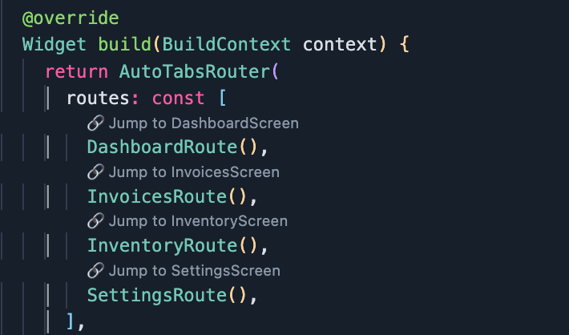

# Auto Route Finder

A VSCode extension that helps Flutter developers easily jump to the definition of classes generated by the [AutoRoute package](https://pub.dev/packages/auto_route).


## Features

- **Automatic Route Detection**: Monitors Dart files for `*Route` class names (e.g., `HomeRoute`, `SettingsRoute`)
- **Inline CodeLens**: Displays "Jump to Definition" buttons above matched route classes
- **Smart Navigation**: Automatically finds and opens the corresponding widget file using import paths from `routes.gr.dart`
- **Real-time Updates**: Refreshes when routes.gr.dart file is saved
- **Zero Configuration**: Works out of the box with standard AutoRoute setups



## How It Works

1. **Route Detection**: The extension scans your `routes.gr.dart` file to find route definitions
2. **CodeLens Display**: When you open a Dart file containing `*Route` classes, it shows inline "Jump to Definition" buttons
3. **Smart Navigation**: When you click a button, it:
   - Converts the widget name to snake_case (e.g., `CompaniesScreen` → `companies_screen`)
   - Finds the matching import in `routes.gr.dart`
   - Converts the package path to a file system path
   - Opens the correct file and focuses on the class definition

## Requirements

- Flutter project with AutoRoute package
- Generated `routes.gr.dart` file at `lib/routes.gr.dart`

## Usage

1. **Install the extension**
2. **Open a Dart file** containing route references (e.g., `CompaniesRoute()`)
3. **Look for the CodeLens button** above the route class (e.g., "🔗 Jump to CompaniesScreen")
4. **Click the button** to navigate to the corresponding widget file

## Example

```dart
// In your Dart file
context.router.push(const CompaniesRoute());

// The extension will:
// 1. Detect CompaniesRoute
// 2. Show "🔗 Jump to CompaniesScreen" button
// 3. When clicked, find this import in routes.gr.dart:
//    import 'package:myapp/features/companies/screens/companies_screen.dart' as _i4;
// 4. Convert to: lib/features/companies/screens/companies_screen.dart
// 5. Open the file and focus on the CompaniesScreen class
```

## File Structure Support

The extension automatically handles various project structures by reading import paths from `routes.gr.dart`:

```
lib/
├── routes.gr.dart
├── features/
│   ├── companies/
│   │   └── screens/
│   │       └── companies_screen.dart
│   └── profile/
│       └── screens/
│           └── profile_detail_screen.dart
└── main.dart
```

## Troubleshooting

### No CodeLens Buttons Appear

1. **Check routes.gr.dart exists**: Ensure the file is at `lib/routes.gr.dart`
2. **Verify AutoRoute setup**: Make sure your routes are properly generated
3. **Check console logs**: Open Developer Tools to see debug information

### "No file path found" Error

1. **Check import statements**: Ensure your `routes.gr.dart` contains proper import statements
2. **Verify file naming**: Widget files should be in snake_case (e.g., `companies_screen.dart`)
3. **Check file structure**: Ensure the file exists at the path specified in the import

### File Not Found Error

1. **Verify file exists**: Check that the widget file actually exists
2. **Check import path**: Ensure the import path in `routes.gr.dart` is correct
3. **Check workspace**: Make sure you're in the correct Flutter project root

## Debugging

The extension provides detailed console logging. To see debug information:

1. Open **Help > Toggle Developer Tools**
2. Look for messages starting with "Auto Route Finder:"
3. Check for file path resolution and import matching logs

## Release Notes

### 0.0.1

- **Simple & Direct Approach**: Uses import paths from `routes.gr.dart` for accurate file navigation
- **Snake Case Conversion**: Automatically converts widget names to snake_case for file matching
- **Package Path Resolution**: Converts `package:app/path` to `lib/path` automatically
- **Zero Configuration**: Works out of the box with standard Flutter/AutoRoute projects
- **Real-time Updates**: Automatically refreshes when `routes.gr.dart` is saved

## Contributing

Contributions are welcome! Please feel free to submit issues and pull requests.

## License

MIT License - see LICENSE file for details.